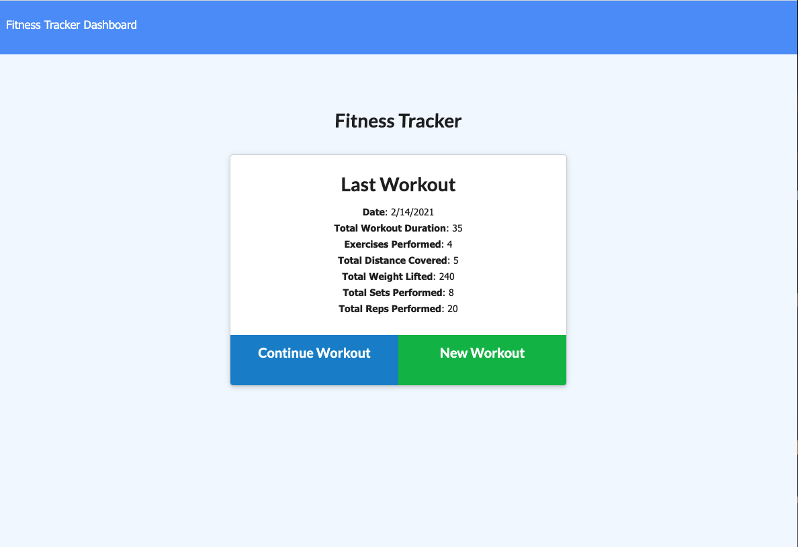
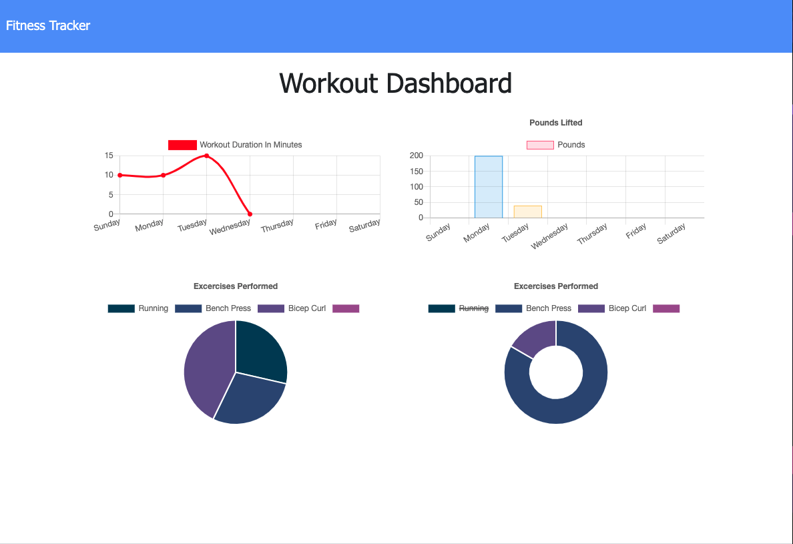

# Fitness-Tracker

## Description

This application allows a user to view and track multiple exercises in a workout including cardio and resistance. The user can track exercise type, time, distance, weight, reps, and sets. They can then view a dashboard with statistics on their workouts.

## Technologies

MongoDB, Mongoose, Node, Express, JavaScript

## Table of Contents

* [Links](#links)

* [Usage](#usage)

* [Conclusion](#conclusion)

## Links

* [GitHub Repo](https://github.com/elizabethbrandt/Fitness-Tracker)

* [Heroku Deployment](https://fitness-tracker-eb.herokuapp.com/)

## Usage

* When a user wants to start a workout, they click "New Workout" and can choose between cardio and resistance. These options give the user different types of data to track - type, distance, and time for cardio, and type, weight, reps, sets, and time for resistance. Once an exercise is done, the user has the option to "Add Exercise" which will add this to the day's total workout. Once completing all exercises, the user clicks "Complete" and it takes them back to the home screen.

* On the screen they will see a summary of their last workout that compiles the total number of all the different data types and adds in the total time

* When a user clicks on "Dashboard" they will be able to see the week's compiled information for all their workouts

* Demo

## Conclusion

I enjoyed being able to explore the functionality of the document-oriented database and see how that differed from MySQL. I like that Mongoose allows you to write in a more JS-like syntax, which I think makes it a bit more user friendly in the way you interact with it and query the data.